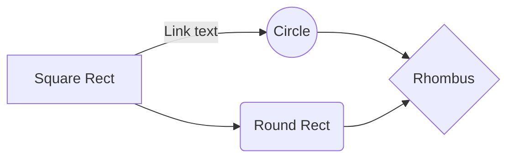

`` Università degli Studi di Milano ``
`` Corso di Editoria Digitale`` 
`` Anno Accademico 2022-2023``
`` Solari Leonardo 941895`` 

# Dispense non ufficiali di Algoritmi e Strutture Dati
  

## Introduzione

Questo progetto nasce dalla volontà di fornire agli studenti del corso un documento che tratti in modo conciso tutti gli argomenti toccati nelle lezioni del corso di Algoritmi e Strutture Dati dell'Università degli Studi di Milano, tenuto dal prof. Pighizzini.

L'intento è quello di raccogliere e integrare tra loro i vari materiali presenti riguardanti il corso (tra cui documenti ufficiali forniti dal professore e appunti presi a lezione personalmente e da altri colleghi) e di fornirli ai colleghi nella forma di un'unica dispensa in modo da facilitare lo studio e la preparazione dell'esame.

Per il formato del prodotto finale ho scelto un PDF, poichè di facile consultazione, largamente utlizzato per documenti in ambito accademico e printer-friendly. Il sorgente è stato scritto in LaTex e compilato tramite il motore XeTex per ottenere il PDF finale, e successivamente convertito in formato HTML tramite il tool Pandoc per una consultazione ottimale anche da web browser. 

## Obiettivi 

L'obiettivo principale di queste dispense è quello di fornire a tutti gli studenti del corso uno strumento che possa rendere più agevole la preparazione dell'esame.

I **destinatari** sono quindi tutti i colleghi che come me apprezzano avere un unico documento che fornisca nel modo più esaustivo possibile tutte le informazioni necessarie a raggiungere una padronanza sufficiente degli argomenti trattati nel corso. 

## Processo di produzione

Descrivere le attività sviluppate all'interno del progetto per realizzare il prodotto.
> Nel farlo è utile riferirsi alle possibili attività elencate nella lezione 5, slide 4-7. 

## Gestione documentale

Descrivere il *flusso di gestione documentale* definito per il progetto. Ad esempio, la raccolta delle fonti, la revisione dei contenuti, la trasformazione dei formati, la strutturazione dei contenuti, la definizione dello stile grafico.
> Il flusso può essere descritto utilizzando BPMN, lezione 5, slide 9. In alternativa, se si preferisce restare su un formato di puro testo è possibile usare il linguaggio Mermaid, supportato da alcuni editor Markdown. 

## Tecnologie adottate

Descrivere le tecnologie addottate e discuterne il contributo in termini di riduzione dei tempi di gestione documentale, riduzione degli errori o miglioramento della qualità dei documenti.

> Per presentare il contributo delle diverse tecnologie addottate è possibile elencarle in una tabella. Può anche essere utili confrontare una versione ASIS del flusso di gestione, senza la tecnologia adottata, e una TOBE che include la tecnologia adottata.
> Includere nella relazione o in appendice gli script e le configurazioni adottati, possibilmente con riferimento ad un repository documentale.  

|                |Riduzione dei tempi di gestione                          |Miglioramento della qualità dei documenti                         |
|----------------|-------------------------------|-----------------------------|
|Markdown |`'Isn't this fun?'`            |'Isn't this fun?'            |
|XSLT       |`"Isn't this fun?"`            |"Isn't this fun?"            |
|ePud         |`-- is en-dash, --- is em-dash`|-- is en-dash, --- is em-dash|

## Conclusioni

Discutere i risultati ottenuti, verificando se gli obiettivi siano pienamente o parzialmente raggiunti. Evidenziare gli aspetti nei quali si sono raggiunti i risultati più soddisfacenti e le limitazioni emerse (impossibilità di accesso ad alcune tecnologie o fasi del flusso di gestione documentale, limiti nella automazione di alcune passi di trasformazione dei formati o di integrazione delle sorgenti). 

## Bibliografia e sitografia

Elencare i riferimenti bibliografici e risorse online che hanno maggiormente contribuito alla realizzazione del progetto.

> Ci possono essere diversi modi di gestire le citazioni in markdown, uno di questi è attraverso le note

Esempio di nota [^fn1]. Altro testo. Altra citazione[^fn2].

[^fn1]: Citazione con nota.
[^fn2]: Altra citazione.