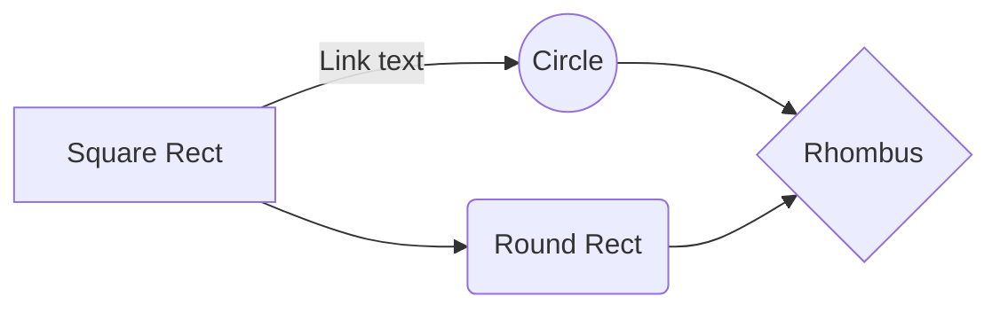

`` Università degli Studi di Milano ``
`` Corso di Editoria Digitale`` 
`` Anno Accademico 2022-2023``
`` Solari Leonardo 941895`` 

# Dispense non ufficiali di Algoritmi e Strutture Dati
  

## Introduzione

Questo progetto nasce dalla volontà di fornire agli studenti del corso un documento che tratti in modo conciso tutti gli argomenti toccati nelle lezioni del corso di Algoritmi e Strutture Dati dell'Università degli Studi di Milano, tenuto dal prof. Pighizzini.

L'intento è quello di raccogliere e integrare tra loro i vari materiali presenti riguardanti il corso (tra cui documenti ufficiali forniti dal professore e appunti presi a lezione personalmente e da altri colleghi) e di fornirli ai colleghi nella forma di un'unica dispensa in modo da facilitare lo studio e la preparazione dell'esame.

Per il formato del prodotto finale ho scelto un PDF, poichè di facile consultazione, largamente utlizzato per documenti in ambito accademico e printer-friendly. Il sorgente è stato scritto in LaTeX e compilato tramite il motore XeTeX per ottenere il PDF finale, e successivamente convertito in formato HTML tramite il tool Pandoc per una consultazione ottimale anche da web browser. 

## Obiettivi 

L'obiettivo principale di queste dispense è quello di fornire a tutti gli studenti del corso uno strumento che possa rendere più agevole la preparazione dell'esame.

I **destinatari** sono quindi tutti i colleghi che come me apprezzano avere un unico documento che fornisca nel modo più esaustivo possibile tutte le informazioni necessarie a raggiungere una padronanza sufficiente degli argomenti trattati nel corso.

Tale documento deve integrare il più possibile tutti i materiali disponibili e presentare alcune caratteristiche tra cui:

* Codice sorgente diviso per capitoli, per facilitare le revisioni e l'aggiunta o la rimozione di materiale
* Indice dei contenuti interattivo per cercare e raggiungere velocemente sezioni di interesse
* In ogni capitolo, in base alla necessità, tabelle, grafi, formule e immagini che arricchiscano e rendano più agevole la fruizione del contenuto
* Grafica ordinata, pulita e senza elementi di distrazione
* Essere facilmente consultabile su PC e dispositivi mobili ma anche in un formato adatto alla stampa, per coloro che preferiscono studiare tramite materiale cartaceo.

## Processo di produzione

### Studio e analisi del tema
Il corso di Algoritmi e strutture Dati tenuto dal prof. Pighizzini è caratterizzato da una grande mole di contenuti e di conseguenza il materialemdisponibile per lo studio è molto, ma tuttavia "sparso". Preparando l'esame mi sono infatti reso conto che per studiare ogni argomento dovevo consultare diversi documenti per raccogliere tutte le informazioni necessarie e la cosa risultava spesso fastidiosa. Da qui nasce l'idea di creare un prodotto che raccogliesse e integrasse tutti questi contenuti e che potesse essere utile per me e per i colleghi del corso.

#### Definizione del target
Come già accennato i possibili fruitori di questo progetto sono gli studenti del corso di Algoritmi che come me apprezzano studiare da un'unica fonte che raccolga tutto il materiale disponibile e fornisca una panoramica completa sugli argomenti trattati. Per quanto sia importante sviluppare la capacità di ricerca autonoma dei materiali tra le varie fonti disponibili, trovo che spesso questo processo possa portare facilmente a difficoltà o distrazioni, soprattutto nella prima fase dello studio per la preparazione di un esame, durante la quale non si ha ancora una conoscenza solida degli argomenti.

#### Studio competitor
In questa fase del lavoro mi sono innanzitutto assicurato che non esistesse già un progetto simile a quello che avevo in mente. Ho trovato alcuni materiali prodotti da altri colleghi ma questi non avevano la completezza e l'ordine che desideravo.

#### Definizione dei canali e licenze di distribuzione
Idealmente il prodotto nasce con l'intento di essere sotto licenza libera. Tuttavia alcuni materiali sono tratti da documenti ufficiali del corso forniti dal prof. Pighizzini e sono protetti da copyright. L'utilizzo che ho effettuato di tali materiali per questo progetto rispetta le condizioni poste dall'autore in quanto rientra nell'utilizzo per scopi accademici. È tuttavia importante che chiunque effettui successive modifiche e distribuzioni del prodotto rispetti la nota di copyright riportata per intero nella prefazione del documento finale.

#### Identificazione delle fonti
Il materiale che ho utilizzato per la stesura del documento proviene principalmente da:

* Documenti PDF ufficiali del corso forniti dal prof. Pighizzini. Tali documenti contengono diagrammi e pseudocodice degli algoritmi trattati e la loro spiegazione
* Slide prodotte dal prof. Pighizzini durante le lezioni
* Appunti presi personalmente a lezione
* Appunti di altri colleghi
* Informazioni reperite sul web o su libri di testo

#### Definizione dei formati
La scelta dei formati è ricaduta su:

* **LaTeX** per il codice sorgente, in quanto adatto al contenuto ricco di formule matematiche e per l'ottimo risultato prodotto in termini grafici una volta compilato
* **PDF** come formato principale per il prodotto finale, in quanto consultabile da praticamente qualsiasi dispositivo fisso e portatile e già pronto alla stampa
* **HTML** come ulteriore formato del prodotto finale per favorire la consultazione del prodotto da web browser. Il documento in tale formato è stato ottenuto tramite una conversione del sorgente LaTeX grazie al tool **Pandoc**.

* ### Stesura bozza e revisione dei contenuti
	
	* #### Punti da trattare
	La prima fase riguardante la vera e propria stesura del documento è consistita nello stilare una lista degli argomenti trattati nel corso e della loro divisione in capitoli e paragrafi. Per fare ciò mi sono servito dei materiali a mia disposizione già elencati nella fase di identificazione delle fonti, e per dare loro un'ordine ho seguito la cronologia delle lezioni caricate sulla pagina Ariel del corso.
	
	* #### Sviluppo dei contenuti
	Successivamente sono passato ad una trattazione più esaustiva possibile di ogni argomento integrando tutte le informazioni in mio possesso tratte dalle fonti che avevo a disposizione. In tale fase ho già provveduto a inserire codice sorgente e formule matematiche ove necessario grazie agli appositi pacchetti del linguaggio LaTeX.
	
	* #### Identificazione degli elementi multimediali
	Ove necessario sono state inserite immagini, grafici e tabelle che arricchissero la trattazione degli argomenti.
	
	* #### Revisione
	Il documento è stato infine revisionato manualmente in cerca di errori di battitura o impaginazione e imprecisioni.
	
* ### Definizione dello stile grafico
La formattazione del testo, l'impaginazione e in generale la maggior parte di tutto ciò che riguarda l'aspetto grafico del documento sono gestiti in modo automatico da LaTeX. La scelta del linguaggio è ricaduta appunto su LaTeX proprio per via della pulizia, dell'ordine e della rigorosità dei documenti ottenuti tramite tale tecnologia. È ottima la gestione degli elementi matematici come formule e simboli, presenti in grande quantità in questo progetto. Inoltre Lo stile del prodotto finale è consono ad un utilizzo in ambito accademico e coerente con i doumenti ufficiali del corso.
Sono stati aggiunti alcuni elementi grafici come la numerazione delle pagine e la presenza di un header per rendere ancor più gradevole il risultato.

* ### Creazione del formato di distribuzione
Una volta terminata la fase di stesura effettiva del documento, per ottenere il PDF finale è stato sufficiente compilare il sorgente LaTeX tramite il motore XeTeX e sistemare alcuni errori o imprecisioni nell'impaginazione del documento o nel posizionamento delle immagini. 
Per quanto riguarda il file HTML, tramite l'utilizzo del tool Pandoc è stato possibile convertire il codice sorgente nel formato desiderato. È stato poi necessario intervenire manualmente sul prodotto per renderlo il più possibile simile al formato PDF.
	 

## Gestione documentale

Descrivere il *flusso di gestione documentale* definito per il progetto. Ad esempio, la raccolta delle fonti, la revisione dei contenuti, la trasformazione dei formati, la strutturazione dei contenuti, la definizione dello stile grafico.
> Il flusso può essere descritto utilizzando BPMN, lezione 5, slide 9. In alternativa, se si preferisce restare su un formato di puro testo è possibile usare il linguaggio Mermaid, supportato da alcuni editor Markdown. 

## Tecnologie adottate

Descrivere le tecnologie addottate e discuterne il contributo in termini di riduzione dei tempi di gestione documentale, riduzione degli errori o miglioramento della qualità dei documenti.

> Per presentare il contributo delle diverse tecnologie addottate è possibile elencarle in una tabella. Può anche essere utili confrontare una versione ASIS del flusso di gestione, senza la tecnologia adottata, e una TOBE che include la tecnologia adottata.
> Includere nella relazione o in appendice gli script e le configurazioni adottati, possibilmente con riferimento ad un repository documentale.  

|                |Riduzione dei tempi di gestione                          |Miglioramento della qualità dei documenti                         |
|----------------|-------------------------------|-----------------------------|
|Markdown |`'Isn't this fun?'`            |'Isn't this fun?'            |
|XSLT       |`"Isn't this fun?"`            |"Isn't this fun?"            |
|ePud         |`-- is en-dash, --- is em-dash`|-- is en-dash, --- is em-dash|

## Conclusioni

Discutere i risultati ottenuti, verificando se gli obiettivi siano pienamente o parzialmente raggiunti. Evidenziare gli aspetti nei quali si sono raggiunti i risultati più soddisfacenti e le limitazioni emerse (impossibilità di accesso ad alcune tecnologie o fasi del flusso di gestione documentale, limiti nella automazione di alcune passi di trasformazione dei formati o di integrazione delle sorgenti). 

## Bibliografia e sitografia

Elencare i riferimenti bibliografici e risorse online che hanno maggiormente contribuito alla realizzazione del progetto.

> Ci possono essere diversi modi di gestire le citazioni in markdown, uno di questi è attraverso le note

Esempio di nota [^fn1]. Altro testo. Altra citazione[^fn2].

[^fn1]: Citazione con nota.
[^fn2]: Altra citazione.