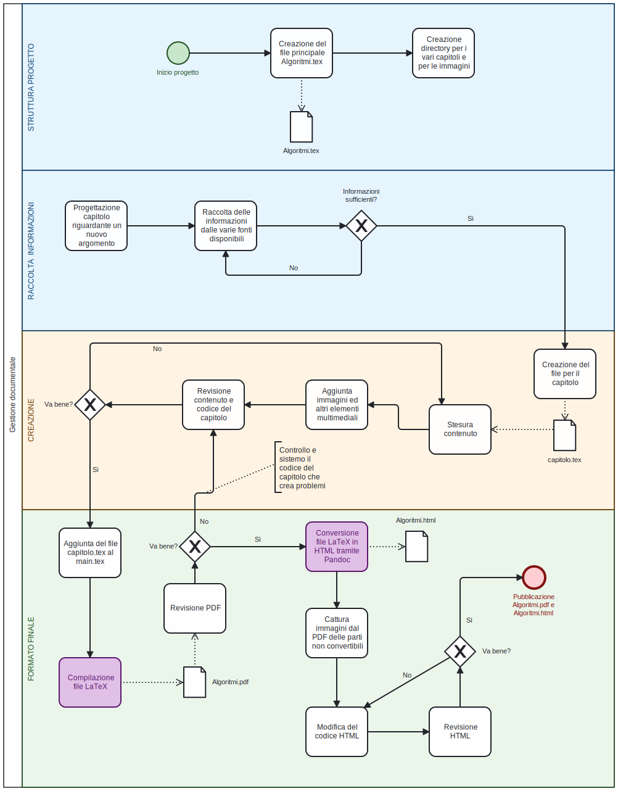

`` Università degli Studi di Milano ``
`` Corso di Editoria Digitale`` 
`` Anno Accademico 2022-2023``
`` Solari Leonardo 941895`` 

# Dispense non ufficiali di Algoritmi e Strutture Dati
  
[Link alla repository del progetto](https://github.com/leonardosolari/Progetto-Editoria-Digitale)

## Introduzione

Questo progetto nasce dalla volontà di fornire agli studenti un documento che tratti in modo conciso tutti gli argomenti toccati nelle lezioni del corso di Algoritmi e Strutture Dati dell'Università degli Studi di Milano, tenuto dal prof. Pighizzini.

L'intento è quello di raccogliere e integrare tra loro i vari materiali presenti riguardanti il corso (tra cui documenti ufficiali forniti dal professore e appunti presi a lezione personalmente e da altri colleghi) e di fornirli ai colleghi nella forma di un'unica dispensa in modo da facilitare lo studio e la preparazione dell'esame.

Per il formato del prodotto finale ho scelto un PDF, poichè di facile consultazione, largamente utlizzato per documenti in ambito accademico e printer-friendly. Il sorgente è stato scritto in LaTeX e compilato tramite il motore XeTeX per ottenere il PDF finale, e successivamente convertito in formato HTML tramite il tool Pandoc per una consultazione ottimale anche da web browser. 

## Obiettivi 

L'obiettivo principale di queste dispense è quello di fornire a tutti gli studenti del corso uno strumento che possa rendere più agevole la preparazione dell'esame.

I **destinatari** sono quindi tutti i colleghi che come me apprezzano avere un unico documento che fornisca nel modo più esaustivo possibile tutte le informazioni necessarie a raggiungere una padronanza sufficiente degli argomenti trattati nel corso.

Tale documento deve integrare il più possibile tutti i materiali disponibili e presentare alcune caratteristiche tra cui:


* Codice sorgente diviso per capitoli, per facilitare le revisioni e l'aggiunta o la rimozione di materiale
* Indice dei contenuti interattivo per cercare e raggiungere velocemente sezioni di interesse
* In ogni capitolo, in base alla necessità, tabelle, grafi, codice, formule e immagini che arricchiscano e rendano più agevole la fruizione del contenuto
* Grafica ordinata, pulita e senza elementi di distrazione
* Essere facilmente consultabile su PC e dispositivi mobili ma anche in un formato adatto alla stampa, per coloro che preferiscono studiare tramite materiale cartaceo.


## Processo di produzione

### Studio e analisi del tema
Il corso di Algoritmi e strutture Dati tenuto dal prof. Pighizzini è caratterizzato da una grande mole di contenuti e di conseguenza il materiale disponibile per lo studio è molto, ma tuttavia "sparso". Preparando l'esame mi sono infatti reso conto che per studiare ogni argomento dovevo consultare diversi documenti per raccogliere tutte le informazioni necessarie e la cosa risultava spesso fastidiosa. Da qui nasce l'idea di creare un prodotto che raccogliesse e integrasse tutti questi contenuti e che potesse essere utile per me e per i colleghi del corso.

#### Definizione del target
Come già accennato i possibili fruitori di questo progetto sono gli studenti del corso di Algoritmi che come me apprezzano studiare da un'unica fonte che raccolga tutto il materiale disponibile e fornisca una panoramica completa sugli argomenti trattati. Per quanto sia importante sviluppare la capacità di ricerca autonoma dei materiali tra le varie fonti disponibili, trovo che spesso questo processo possa portare facilmente a difficoltà o distrazioni, soprattutto nella prima fase dello studio per la preparazione di un esame, durante la quale non si ha ancora una conoscenza solida degli argomenti.


#### Studio competitor
In questa fase del lavoro mi sono innanzitutto assicurato che non esistesse già un progetto simile a quello che avevo in mente. Ho trovato alcuni materiali prodotti da altri colleghi ma questi non avevano la completezza e l'ordine che desideravo.

#### Definizione dei canali e licenze di distribuzione
Idealmente il prodotto nasce con l'intento di essere sotto licenza libera. Tuttavia alcuni materiali sono tratti da documenti ufficiali del corso forniti dal prof. Pighizzini e sono protetti da copyright. L'utilizzo che ho effettuato di tali materiali per questo progetto rispetta le condizioni poste dall'autore in quanto rientra nell'utilizzo per scopi accademici. È tuttavia importante che chiunque effettui successive modifiche e distribuzioni del prodotto rispetti e riporti la nota di copyright riportata per intero nella prefazione del documento finale, come indicato nella nota stessa.

#### Identificazione delle fonti
Il materiale che ho utilizzato per la stesura del documento proviene principalmente da:

* Documenti PDF ufficiali del corso forniti dal prof. Pighizzini. Tali documenti contengono diagrammi e pseudocodice degli algoritmi trattati e la loro spiegazione
* Slide prodotte dal prof. Pighizzini durante le lezioni
* Appunti presi personalmente a lezione
* Appunti di altri colleghi
* Informazioni reperite sul web o su libri di testo

#### Definizione dei formati
La scelta dei formati è ricaduta su:

* **LaTeX** per il codice sorgente, in quanto adatto al contenuto ricco di formule matematiche e per l'ottimo risultato prodotto in termini grafici una volta compilato

* **PDF** come formato principale per il prodotto finale, in quanto consultabile da praticamente qualsiasi dispositivo fisso e portatile e già pronto alla stampa

* **HTML** come ulteriore formato del prodotto finale per favorire la consultazione del prodotto da web browser. Il documento in tale formato è stato ottenuto tramite una conversione del sorgente LaTeX grazie al tool **Pandoc**.

### Stesura bozza e revisione dei contenuti
	
* #### Punti da trattare
	La prima fase riguardante la vera e propria stesura del documento è consistita nello stilare una lista degli argomenti trattati nel corso e della loro divisione in capitoli e paragrafi. Per fare ciò mi sono servito dei materiali a mia disposizione già elencati nella fase di identificazione delle fonti, e per dare loro un ordine ho seguito la cronologia delle lezioni caricate sulla pagina Ariel del corso.
	
* #### Sviluppo dei contenuti
	Successivamente sono passato ad una trattazione più esaustiva possibile di ogni argomento integrando tutte le informazioni in mio possesso tratte dalle fonti che avevo a disposizione. In tale fase ho già provveduto a inserire codice sorgente e formule matematiche ove necessario grazie agli appositi pacchetti del linguaggio LaTeX.
	
* #### Identificazione degli elementi multimediali
	Ove necessario sono state inserite immagini, pseudocodice grafici e tabelle che arricchissero la trattazione degli argomenti. Tutti gli elementi multimediali sono stati gestiti tramite gli appositi pacchetti offerti dal linguaggio LaTeX
	
* #### Revisione
	Il documento è stato infine revisionato manualmente in cerca di errori di battitura o impaginazione e imprecisioni.
	
### Definizione dello stile grafico
La formattazione del testo, l'impaginazione e in generale la maggior parte di tutto ciò che riguarda l'aspetto grafico del documento sono gestiti in modo automatico da LaTeX. La scelta del linguaggio è ricaduta appunto su LaTeX proprio per via della pulizia, dell'ordine e della rigorosità dei documenti ottenuti tramite tale tecnologia. È ottima la gestione degli elementi matematici come formule e simboli, presenti in grande quantità in questo progetto. Inoltre Lo stile del prodotto finale è consono ad un utilizzo in ambito accademico e coerente con i doumenti ufficiali del corso.
Sono stati aggiunti alcuni elementi grafici come la numerazione delle pagine e la presenza di un header per rendere ancor più gradevole il risultato.

### Creazione del formato di distribuzione
Una volta terminata la fase di stesura effettiva del documento, per ottenere il PDF finale è stato sufficiente compilare il sorgente LaTeX tramite il motore XeTeX e sistemare alcuni errori o imprecisioni nell'impaginazione del documento o nel posizionamento delle immagini. 
Per quanto riguarda il file HTML, tramite l'utilizzo del tool Pandoc è stato possibile convertire il codice sorgente nel formato desiderato. È stato poi necessario intervenire manualmente sul prodotto per renderlo il più possibile simile al formato PDF.
	 


## Gestione documentale



## Tecnologie adottate

Di seguito sono elencate le tecnologie utilizzate per questo progetto. Seguirà poi una trattazione dei dettagli di come sono state utilizzate.

* LaTeX
* Pandoc
* HTML
* make
* GitHub

### LaTeX
I motivi che mi hanno portato a scegliere LaTeX come linguaggio per sviluppare queste dispense sono stati molteplici, tra cui:

* È un software libero, gratuito e multipiattaforma
* È un linguaggio ampiamente usato, in particolar modo nel mondo accademico per le caratteristiche di gestione dell'impaginazione. È ottimo per la scrittura di testi contenenti formule, di cui questo progetto è ricco. È inoltre un linguaggio ottimo per disegnare grafici, tabelle e molto altro
* Anche con settaggi di base genera documenti caratterizzati da un alto livello di professionalità, qualità e rigore
* Spinge l'utente a pensare e occuparsi anche della tipografia del documento permettendo di ottenere un risultato adatto ad ogni tipo di esigenza
* Gestisce bene riferimenti incrociati, bibliografia ed è in grado di generare automaticamente gli indici degli elementi

Lo sviluppo di questo progetto è avvenuto in ambiente MacOS tramite una distribuzione MacTeX.

La struttura del codice è stata organizzata nel seguente modo: è presente un file principale ```Algoritmi.tex```, il quale contiene il codice necessario a gestire la schermata del titolo, l'indice dei contenuti, e nel quale sono inseriti grazie al comando ```\input``` i file dei vari capitoli. Sono inoltre presenti i metadati del documento e tutte le impostazioni necessarie a ottenere il risultato desiderato in termini grafici.

Particolarmente degno di nota per questo progetto è l'utilizzo dei pacchetti:

* ```hyperref``` per gestire i metadati e l'indice dei contenuti con riferimenti
* ```graphicx``` per la gestione delle immagini
* ```amsmath``` e ```amsfonts``` per i simboli matematici
* ```algorithm2e``` per lo pseudocodice degli algoritmi
* ```fancyhdr``` per l'utilizzo di un header che migliora l'aspetto grafico del documento

> Ritengo corretto sottolineare che la maggior parte (non la totalità) dello pseudocodice presente nelle dispense è stato inserito non tramite il pacchetto algorithm2e bensì sotto forma di  immagini tratte direttamente dai documenti ufficiali del prof. Pighizzini. Questo per via del grande risparmio di tempo apportato e per via del fatto che, come dirò in seguito nella parte relativa alle tecnologie utilizzate, risultava una scelta migliore per la conversione in tale formato. 

Per quanto riguarda la compilazione del codice sorgente, ovvero l'effettiva produzione del file PDF finale, è stato utilizzato il motore XeTeX, e in particolare il comando

```bash
xelatex -interaction=nonstopmode -output-driver='xdvipdfmx -z3' Algoritmi.tex
```
Per quanto riguarda i flags:

* ```-interaction=nonstopmode``` dice al compilatore di continuare senza interazione con l'utente anche qualora dovesse incontrare degli errori, tranne nel caso di errori "gravi" dove la compilazione viene arrestata
* ```-output-driver='xdvipdfmx -z3``` serve per impostare il fattore di compressione. Ho cercato un buon compromesso tra velocità di compilazione e dimensione del file finale

È importante sottolineare che per ottenere la *table of contents* è necessario eseguire due volte il comando per la compilazione. Questo perchè durante la prima compilazione il compilatore non sa ancora l'ordine delle varie sezioni del documento, ma genera un file .toc che verrà utilizzato dal compilatore nella seconda esecuzione per generare appunto l'indice.

### Pandoc
Pandoc è un tool che permette la conversione tra vari linguaggi di markup. In questo progetto è stato utilizzato per convertire il codice sorgente LaTeX in un file HTML.
Il comando utilizzato è stato:

```bash
pandoc Algoritmi.tex --toc -s --number-sections --mathjax --resource-path='./images' --extract-media=images -o Algoritmi.html
```

* ```--toc``` serve per generare la table of contents
* ```-s``` dice a Pandoc di generare un file HTML standalone 
* ```--number-sections``` serve per numerare le sezioni del documento
* ```--mathjax``` serve per poter visualizzare correttamente le formule matematiche scritte in LaTeX
* ```--resource-path='./images' --extract-media=images``` servono per visualizzare correttamente le immagini senza la necessità di intervenire sul codice HTML
* ```-o``` serve per indicare il nome del file output

Grazie all'utilizzo dei flag sopra elencati la conversione da LaTeX ad HTML risulta rapida e quasi automatizzata.
Le uniche modifiche apportate manualmente sono state:

* Modifica di alcuni elementi grafici
* Modifica della pagina del titolo che non veniva visualizzata correttamente
* Modifica e aggiunta di alcune immagini

In particolare, per quanto riguarda le immagini è importante precisare che tutte le immagini che in LaTeX erano "wrapfigure", non sono state gestite in modo corretto nella conversione e quindi sono state sistemate manualmente.

Inoltre, tutte le porzioni di pseudocodice generate tramite il pacchetto ```algorithm2e``` non erano graficamente accettabili una volta convertite. La soluzione più semplice è stata quindi rimpiazzarle con delle immagini tratte dal file PDF.

### make
Citando direttamente da Wikipedia:

> Il make è un'utility, sviluppata sui sistemi operativi della famiglia UNIX, ma disponibile su un'ampia gamma di sistemi, che automatizza il processo di creazione di file che dipendono da altri file, risolvendo le dipendenze e invocando programmi esterni per il lavoro necessario. [^fn1]

Nella repository del progetto è presente un ```Makefile``` che è stato utilizzato per velocizzare e automatizzare le fasi di compilazione del codice sorgente e della conversione. Tale file ha reso possibile l'esecuzione dei comandi:

* ```make pdf```, che esegue due volte il comando per la compilazione del codice sorgente LaTeX
* ```make html```, che esegue il comando per la conversione tramite Pandoc. Non gestisce le modifiche eseguite manualmente elencate in precedenza
* ```make clean```, che rimuove i file ausiliari generati durante la compilazione LaTeX
* ```make``` o ```make all``` che esegue tutti i comandi precedentemente elencati


## Conclusioni

I risultati ottenuti sono in linea con gli obiettivi di partenza e quindi abbastanza soddisfacenti, soprattutto per quanto riguarda il documento PDF.

Il prodotto ottenuto rappresenta a mio parere una buona fonte di informazioni per la preparazione dell'esame di Algoritmi e Strutture Dati, ed è esteticamente gradevole e ordinato e coerente con i documenti uffciciali del corso. La navigazione e la ricerca di determinati argomenti risultano agevoli grazie all'indice dei contenuti con collegamenti interattivi e riferimento al numero di pagina. 

Sicuramente molti aspetti possono essere ancora migliorati.
Innanzitutto, come già accennato in precedenza, è risultato meglio in termini pratici inserire gran parte dello pseudocodice sotto forma di immagine e non di codice vero e proprio. Avendo accesso al codice sorgente dei documenti prodotti dal prof. Pighizzini sarebbe possibile sicuramente ottenere un risultato migliore, almeno per quanto riguarda il documento PDF.

Lato conversione in HTML invece, un possibile miglioramento futuro potrebbe essere quello di automatizzare le modifiche manuali delle immagini e degli elementi grafici tramite per esempio uno script python, in modo tale da facilitare un lavoro che ora risulta tedioso ogni volta che il codice sorgente viene modificato in modo sostanzioso.
Sarebbe inoltre molto utile migliorare la conversione dello pseudocodice. Ciò potrebbe avvenire tramite un Lua Filter [^fn2] di Pandoc appositamente scritto per convertire le opportune sezioni di codice LaTeX in immagini.

## Bibliografia e sitografia

* [Sito Ariel di Algoritmi e Strutture Dati](https://gpighizziniasd.ariel.ctu.unimi.it/v5/Home/)
* [LaTeX](https://www.latex-project.org)
* [Pandoc](https://pandoc.org)
* [Tool per il diagramma di gestione documentale](https://bpmn.io)

[^fn1]: [make](https://it.wikipedia.org/wiki/Make)
[^fn2]: [Lua Filters](https://pandoc.org/lua-filters.html)

